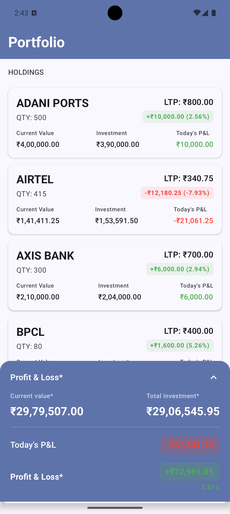
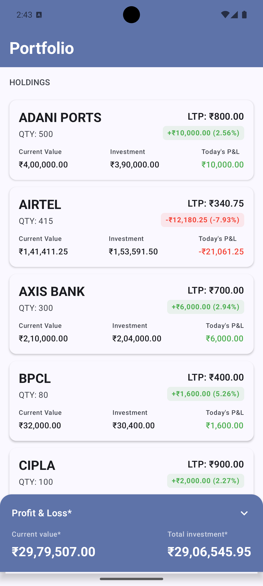

# 📱 Portfolio Demo App

A modern Android application showcasing investment portfolio management with real-time stock
holdings, P&L calculations, and comprehensive financial analytics.

## 📸 Screenshots

<div align="center">
  
  
  <br/>
  <em>Portfolio Holdings & Summary Views</em>
</div>

## 🏷️ Badges

[](https://developer.android.com)
[](https://kotlinlang.org)
[](https://developer.android.com/jetpack/compose)
[](https://blog.cleancoder.com/uncle-bob/2012/08/13/the-clean-architecture.html)

## 🏗️ Architecture

This project follows **Clean Architecture** principles with modern Android development practices:

```
├── 📱 UI Layer (Presentation)
│   ├── Jetpack Compose UI
│   ├── ViewModels with StateFlow
│   └── Navigation Components
├── 🔄 Domain Layer (Business Logic)
│   ├── Use Cases
│   ├── Repository Interfaces
│   └── Domain Models
└── 💾 Data Layer
    ├── Remote API (Retrofit + Kotlin Serialization)
    ├── Local Database (Room)
    ├── Repository Implementations
    └── Data Mappers
```

## ✨ Features

### 📊 Portfolio Management

- **Real-time portfolio summary** with current value and total investment
- **Individual stock holdings** with detailed P&L calculations
- **Today's P&L tracking** for daily performance monitoring
- **Percentage gains/losses** with visual indicators

### 🎨 Modern UI/UX

- **Material Design 3** with dynamic theming
- **Jetpack Compose** for declarative UI development
- **Responsive design** adapting to different screen sizes
- **Loading states and error handling** with user-friendly messages
- **Pull-to-refresh** functionality for data updates

### 🚀 Technical Features

- **Offline-first approach** with local caching using Room database
- **Network connectivity monitoring** with automatic retry mechanisms
- **Dependency injection** using Dagger Hilt
- **Reactive programming** with Kotlin Coroutines and Flow
- **Comprehensive unit testing** with MockK and Turbine
- **Code coverage reporting** with Jacoco

## 🛠️ Tech Stack

### Core Technologies

- **Kotlin** - Primary programming language
- **Jetpack Compose** - Modern UI toolkit
- **Coroutines & Flow** - Asynchronous programming
- **Dagger Hilt** - Dependency injection

### Architecture Components

- **ViewModel** - UI-related data holder
- **StateFlow** - Observable state container
- **Room** - Local database with SQLite
- **Navigation Compose** - In-app navigation

### Networking & Serialization

- **Retrofit 2** - Type-safe HTTP client
- **OkHttp 3** - HTTP client with interceptors
- **Kotlin Serialization** - JSON parsing

### Testing

- **JUnit 4** - Unit testing framework
- **MockK** - Mocking library for Kotlin
- **Turbine** - Testing library for Flow
- **Google Truth** - Fluent assertion library
- **Jacoco** - Code coverage reports

### Code Quality

- **KSP** - Kotlin Symbol Processing
- **Proguard** - Code minification and obfuscation
- **Gradle Kotlin DSL** - Build configuration

## 📦 Project Structure

```
app/src/main/java/com/example/vismaypatildemo/
├── 🎯 core/                          # Core utilities
│   ├── NetworkConnectivityManager.kt  # Network state monitoring
│   └── StringResourceProvider.kt      # String resources abstraction
├── 💾 data/                          # Data layer
│   ├── local/                        # Room database
│   ├── remote/                       # Retrofit API services
│   ├── repository/                   # Repository implementations
│   └── mapper/                       # Data transformation
├── 🏢 domain/                        # Business logic layer
│   ├── model/                        # Domain models
│   │   ├── Holding.kt               # Stock holding entity
│   │   └── PortfolioSummary.kt      # Portfolio summary entity
│   ├── repository/                   # Repository interfaces
│   └── usecase/                      # Business use cases
├── 🎨 ui/                           # Presentation layer
│   ├── portfolio/                    # Portfolio feature
│   │   ├── components/               # Reusable UI components
│   │   ├── PortfolioScreen.kt       # Main portfolio screen
│   │   ├── PortfolioViewModel.kt    # Screen state management
│   │   └── PortfolioUiState.kt      # UI state definition
│   └── theme/                        # App theming
├── 🔧 di/                           # Dependency injection
│   ├── DatabaseModule.kt            # Database dependencies
│   ├── NetworkModule.kt             # Network dependencies
│   └── RepositoryModule.kt          # Repository dependencies
├── MainActivity.kt                   # Entry point activity
└── VismayPatilDemoApp.kt            # Application class
```

## 📱 App Features in Detail

### Portfolio Dashboard

- **Summary Card**: Displays total portfolio value, investment amount, and P&L
- **Holdings List**: Shows individual stock positions with:
    - Stock symbol and quantity
    - Last traded price (LTP) and average price
    - Current value and total investment
    - Profit/Loss with percentage and color coding
    - Today's P&L for daily tracking

### Data Management

- **API Integration**: Fetches real-time portfolio data from remote server
- **Local Caching**: Stores data locally for offline access
- **Auto-refresh**: Pulls latest data on app launch and manual refresh
- **Error Handling**: Graceful degradation with user-friendly error messages

### UI/UX Highlights

- **Material Design 3** with adaptive themes
- **Smooth Animations** for state transitions
- **Loading Skeletons** for better perceived performance
- **Error States** with retry options
- **Empty States** with helpful guidance
---